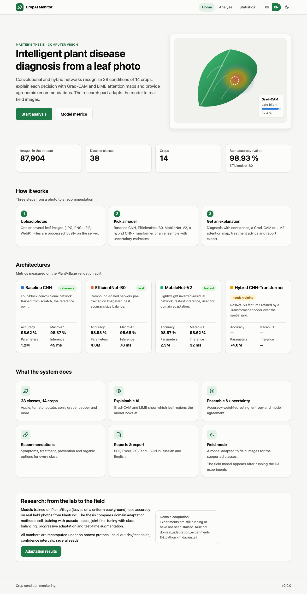
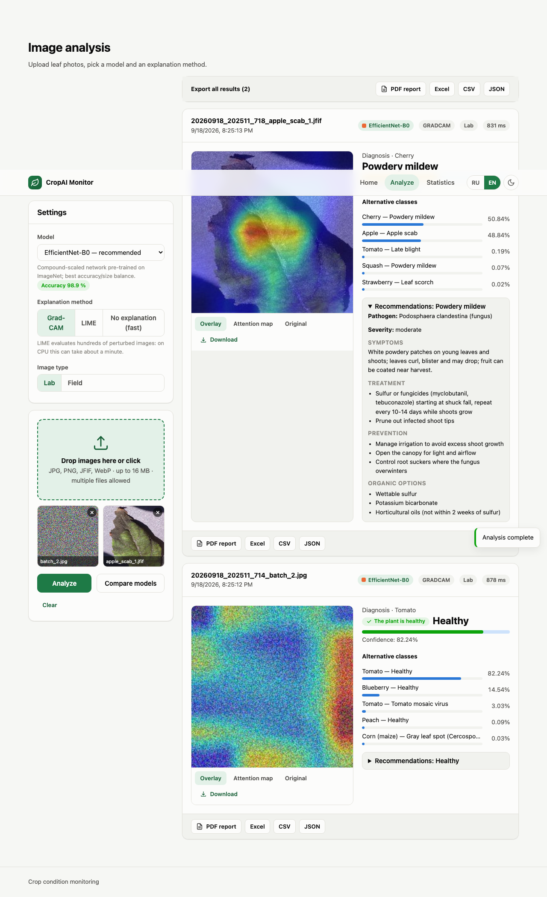
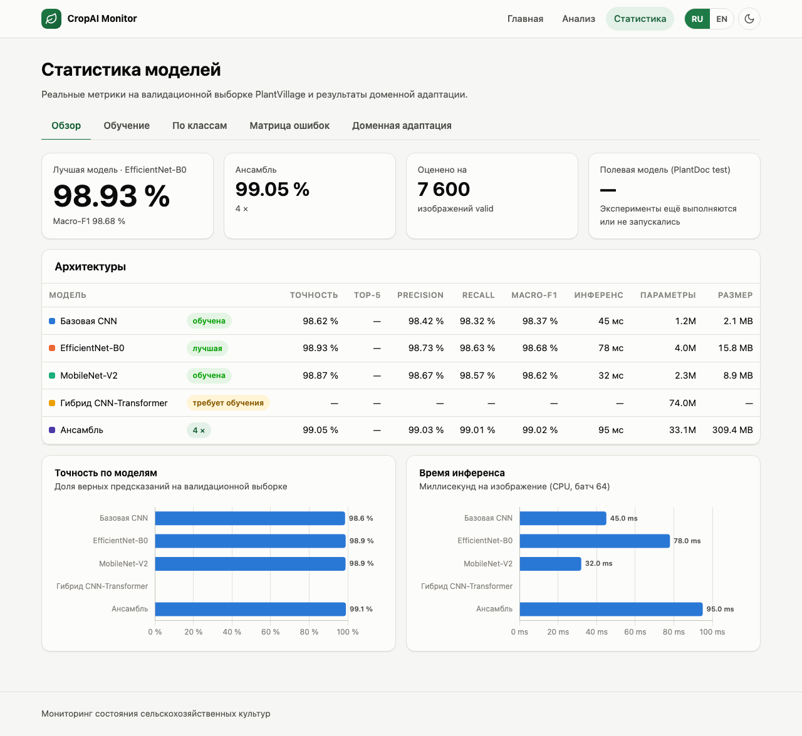

# CropAI Monitor — интеллектуальная система мониторинга состояния сельскохозяйственных культур

Магистерская диссертация: *«Разработка интеллектуальной системы мониторинга состояния
сельскохозяйственных культур с использованием компьютерного зрения и нейронных сетей»*.

Проект состоит из двух частей:

1. **Веб-приложение** — распознавание 38 состояний листьев 14 культур (PlantVillage) четырьмя
   архитектурами (Baseline CNN, EfficientNet-B0, MobileNet-V2, гибрид CNN-Transformer) и их ансамблем,
   объяснение решений (Grad-CAM, LIME), агрономические рекомендации, отчёты PDF/Excel/CSV/JSON,
   интерфейс на русском и английском со светлой и тёмной темой.
2. **Исследование доменной адаптации** — перенос модели с лабораторных снимков PlantVillage на
   полевые фотографии PlantDoc (self-training, совместное дообучение, прогрессивная адаптация, TTA)
   по честному протоколу с отложенными выборками, доверительными интервалами и несколькими сидами.
   Лучшая адаптированная модель подключается к приложению как «полевой режим».



## Быстрый старт

Нужны Python ≥ 3.10 и [uv](https://docs.astral.sh/uv/) (или обычный `pip`).

```bash
git clone https://github.com/shapokok/disser.git && cd disser
uv sync --extra dev                 # окружение .venv со всеми зависимостями
uv run python backend/app.py        # → http://localhost:5001
```

Без uv: `python3 -m venv .venv && source .venv/bin/activate && pip install -r requirements.txt && python backend/app.py`.
Одной командой: `scripts/run.sh` (macOS/Linux) или `scripts\run.bat` (Windows). Docker: `docker compose up --build`.

Порт по умолчанию **5001** (5000 на macOS занят AirPlay Receiver); меняется переменной `CROP_PORT`.
Устройство выбирается автоматически: CUDA → Apple MPS → CPU.

Приложение работает и без весов моделей (страницы открываются, метрики показывают «—»), но для
анализа нужны файлы `models/*.pth` — см. [models/README.md](models/README.md) и
[docs/TRAINING.md](docs/TRAINING.md).

## Что умеет приложение

| Страница | Возможности |
|---|---|
| **Главная** | ключевые цифры датасета, реальные метрики четырёх архитектур, статус полевой модели |
| **Анализ** | загрузка нескольких изображений (drag-and-drop, вставка из буфера), выбор модели или ансамбля, Grad-CAM / LIME / без объяснения, лабораторный или полевой режим, диагноз с уверенностью и top-5, рекомендации (симптомы, лечение, профилактика, органические меры), сравнение всех моделей, экспорт PDF / Excel / CSV / JSON |
| **Статистика** | обзор моделей (точность, top-5, precision/recall/F1, время, размер), кривые обучения, метрики по 38 классам с поиском и сортировкой, интерактивная матрица ошибок 38×38, результаты доменной адаптации с доверительными интервалами |




Все числа в интерфейсе берутся из файлов, которые пишут скрипты оценки
(`models/model_metrics.json`, `results/metrics/*_validation.json`,
`domain_adaptation_experiments/results/summary.json`). В коде нет захардкоженных метрик:
необученная модель честно показывается как «требует обучения» и исключается из ансамбля.

## Данные, обучение, оценка

```bash
python scripts/download_dataset.py             # PlantVillage (Kaggle) → data/PlantVillage/{train,valid}
python scripts/train_models.py                 # обучить все модели (или --models hybrid)
python scripts/evaluate_models.py              # метрики для приложения (обязательно после обучения)
```

Подробности и параметры — в [docs/TRAINING.md](docs/TRAINING.md).

## Доменная адаптация

```bash
cd domain_adaptation_experiments
python -m da.run_all --seeds 42 43 44          # baseline → self-training → joint → progressive → TTA
```

Результат: `results/summary.md`, рисунки `figures/figure1-4.pdf`, модель `models/field_mobilenet_da.pth`.
Протокол, методы и отличие от ранних (некорректно оценённых) результатов описаны в
[domain_adaptation_experiments/README.md](domain_adaptation_experiments/README.md).

## Структура репозитория

```
backend/                  Flask API и статика фронтенда
  app.py                  маршруты (см. docs/API.md)
  config.py               настройки из переменных окружения CROP_*
  model.py                архитектуры и ModelManager (метрики, ансамбль)
  explain.py              Grad-CAM, LIME, препроцессинг
  field_model.py          адаптированная полевая модель
  validation.py           отчёты валидации из results/metrics
  treatments.py, treatment_database.json   рекомендации (ru/en, 38 классов)
  labels.py, class_labels.json             названия классов (ru/en)
  report_generator.py, export_utils.py     PDF / Excel / CSV / JSON
frontend/                 index.html, analyze.html, stats.html, css/, js/ (i18n, темы, Chart.js локально)
scripts/                  download_dataset.py, split_train_valid.py, train_models.py, evaluate_models.py, run.sh/bat
domain_adaptation_experiments/
  da/                     evaluate, self_training, joint_training, progressive, tta, run_all, figures
  results/, figures/      результаты и рисунки; legacy/ — старые скрипты
models/                   class_names.json, model_metrics.json (+ веса *.pth вне git)
data/                     PlantVillage (вне git), uploads/, sample_images/, test_images/
results/metrics/          кривые обучения и файлы валидации
tests/                    pytest (test_units.py, test_api.py) и Playwright (e2e/)
docs/                     API.md, TRAINING.md, DEPLOYMENT.md, TESTING.md
```

## Тесты

```bash
uv run pytest                         # юнит + API (+ инференс, если есть веса)
npx playwright install chromium && npx playwright test    # e2e трёх страниц
```

См. [docs/TESTING.md](docs/TESTING.md). CI (`.github/workflows/ci.yml`) прогоняет ruff, pytest и Playwright.

## Переменные окружения

`CROP_PORT`, `CROP_DEVICE`, `CROP_MODELS`, `CROP_LIME_SAMPLES`, `CROP_TRAINED_THRESHOLD` и другие —
в [docs/DEPLOYMENT.md](docs/DEPLOYMENT.md).

## О честности результатов

* Исходная модель `hybrid_model.pth` оказалась необученной (3,5 % при 38 классах); приложение показывает
  это явно, а скрипт обучения исправлен (`docs/TRAINING.md`).
* Ранние результаты доменной адаптации (76–79 %) были получены при оценке на обучающих изображениях;
  в работе они заменены оценкой на отложенных выборках (см. README исследования).
* Матрицы ошибок и метрики по классам считаются на реальной валидационной выборке, а не генерируются.

## Лицензия

Учебно-исследовательский проект. Код можно использовать в академических целях со ссылкой на работу.
